  

  

  
  
  
  

---

### Hey, I'm Evan

CTO & Co-Founder at **QWERKY AI**, where I build novel LLM architectures from CUDA kernels to production inference. Currently pursuing my **MS in Computer Science at Georgia Tech** while shipping AI systems at scale. Over my career I've accumulated **10+ years of experience**, shipped **15+ production apps**, led teams of **20+ engineers**, and have a **pending LLM patent**.

### What I'm Working On

- **LLM Architecture Research** -- Novel attention mechanisms with custom CUDA implementations
- **State Space Models** -- Contributing Mamba SSM architectures to Modular's MAX framework in Mojo
- **QDistill** -- Transforming transformer layers to state space layers for 4x throughput and 1M token context lengths
- **Open Source** -- Kernels for selective scan, causal conv1d, and RMSNorm in the Modular ecosystem

### Tech Stack

**Languages**

**AI / ML**

**Infrastructure**

### Featured Work

<table>
<tr>
<td width="50%">

**[Modular MAX Framework](https://github.com/modular/modular)**
 Mamba SSM architecture with custom selective scan, causal conv1d, and RMSNorm kernels in Mojo
 

</td>
<td width="50%">

**[Pulley](https://github.com/52inc/Pulley)**
 iOS Maps-style drawer library with 2k+ stars, created at 52 Inc.
 

</td>
</tr>
<tr>
<td width="50%">

**[QWERKY AI](https://qwerky.ai)**
 Novel LLM architectures with a pending patent. QDistill: 4x throughput, 1M token context lengths.
 

</td>
<td width="50%">

**[key-gen](https://github.com/ulmentflam/key-gen)**
 BIP-0044 compatible multi-blockchain key generator
 

</td>
</tr>
<tr>
<td colspan="2" align="center">

**[Robot2815](https://github.com/ulmentflam/Robot2815)** -- FIRST Robotics Competition team code

</td>
</tr>
</table>

### Latest Writing

<!-- BLOG-POST-LIST:START -->
- [Bringing Blazing Fast State Space Models to the Modular MAX Framework](https://qwerky.ai/blog/bringing-blazing-fast-state-space-models-to-the-modular-max-framework) -- Feb 2026
- [Mother May AI: An Opinion on Geoffrey Hinton's Mother AI](https://qwerky.ai/blog/mother-may-ai-an-opinion-on-geoffrey-hintons-mother-ai) -- Sep 2025
- [Attention: The Breakthroughs and the Bottlenecks](https://qwerky.ai/blog/attention-the-breakthroughs-and-the-bottlenecks) -- Jun 2025
- [Incidental Non-Determinism: When AI Surprises You (and Why)](https://qwerky.ai/blog/incidental-non-determinism) -- May 2025
<!-- BLOG-POST-LIST:END -->

[Read more on the QWERKY AI blog &rarr;](https://qwerky.ai/blog)

### GitHub Stats

  
  

  

---

  See more of my work below
    
  

