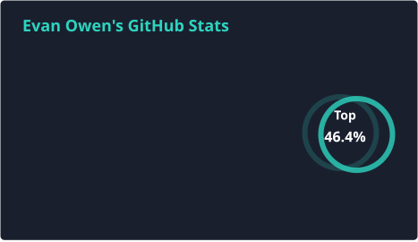
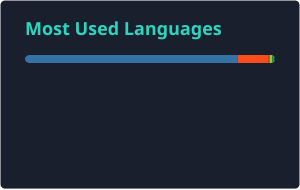

  

  

  
  
  
  

---

### Hey, I'm Evan

AI researcher and systems engineer. A decade shipping in production -- across AI, blockchain, and distributed systems.

Most recently **Co-Founder & CTO at [QWERKY AI](https://qwerky.ai)** -- distilled **70B-parameter LLMs into 3B-8B hybrid models on 24 H200 GPUs**, pending patent on the attention architecture.

Now in the **MS Computer Science** program at **Georgia Tech**. BS CS, *Summa Cum Laude*, University of South Carolina.

### Current Research

- **Novel attention architectures** -- custom CUDA kernels for hybrid LLM distillation (pending patent)
- **State Space Models in [MAX](https://github.com/modular/modular)** -- Mamba SSM in Modular's framework: selective scan, causal conv1d, and RMSNorm kernels written in Mojo

### Tech Stack

**Languages**

**AI / ML**

**Infrastructure**

### Featured Work

<table>
<tr>
<td width="50%">

**[Nightly](https://github.com/ulmentflam/nightly)**
 Turns your coding CLI (Claude Code, Codex, Cursor, Gemini) into a self-directed, drainable session that lands review-shaped PRs by morning.
 

</td>
<td width="50%">

**[Corpus Forge](https://github.com/ulmentflam/corpus-forge)**
 Syncs a local filesystem with a SQL database and vector embeddings -- storage and serving for sovereign AI models.
 

</td>
</tr>
<tr>
<td width="50%">

**[Autosentry](https://github.com/ulmentflam/autosentry)**
 Self-healing supervisor for long-running processes -- watch a command, catch the failure, fix it, leave a paper trail.
 

</td>
<td width="50%">

**[Modular MAX Framework](https://github.com/modular/modular)**
 Mamba SSM architecture with custom selective scan, causal conv1d, and RMSNorm kernels in Mojo
 

</td>
</tr>
<tr>
<td width="50%">

**[QWERKY AI](https://qwerky.ai)**
 Distilled 70B→3B-8B hybrid models on 24 H200 GPUs. 4x inference throughput, 1M token context. Pending patent on novel attention architecture.
 

</td>
<td width="50%">

**[Pulley](https://github.com/52inc/Pulley)**
 iOS Maps-style drawer library with 2k+ stars, created at 52 Inc.
 

</td>
</tr>
</table>

### Latest Writing

<!-- BLOG-POST-LIST:START -->
- [Bringing Blazing Fast State Space Models to the Modular MAX Framework](https://qwerky.ai/blog/bringing-blazing-fast-state-space-models-to-the-modular-max-framework) -- Feb 2026
- [Mother May AI: An Opinion on Geoffrey Hinton's Mother AI](https://qwerky.ai/blog/mother-may-ai-an-opinion-on-geoffrey-hintons-mother-ai) -- Sep 2025
- [Attention: The Breakthroughs and the Bottlenecks](https://qwerky.ai/blog/attention-the-breakthroughs-and-the-bottlenecks) -- Jun 2025
- [Incidental Non-Determinism: When AI Surprises You (and Why)](https://qwerky.ai/blog/incidental-non-determinism) -- May 2025
<!-- BLOG-POST-LIST:END -->

[Read more on the QWERKY AI blog &rarr;](https://qwerky.ai/blog)

### GitHub Stats

  
  

  

---

  

